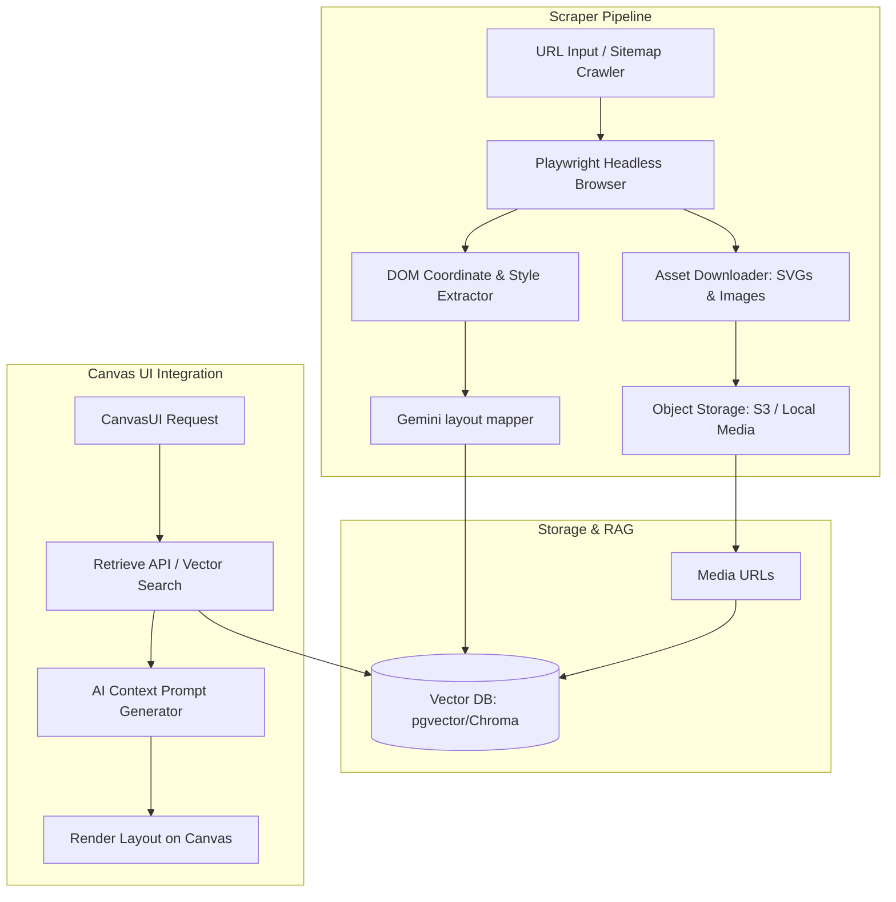

# AI-Powered Design Scraper App: Technical Specification

This document provides a comprehensive technical design and step-by-step implementation guide for building a **standalone AI-powered design scraper**. The goal of this application is to crawl target websites (such as Save the Children), extract visual styles, graphics, and layout structures, and index them into a Vector Database to form a **RAG (Retrieval-Augmented Generation)** system for visual UI builders.

---

## 1. System Architecture

The scraper operates as a standalone microservice that interfaces with target websites, stores processed layouts and assets, and exposes query endpoints for the visual builder.



---

## 2. Capabilities & Requirements

### A. Crawling & Viewport Standardisation
*   **Viewport Normalization:** Crawl and render pages at a fixed resolution of `1200x800` (desktop viewport size of the CanvasUI app).
*   **Javascript Hydration:** Use Playwright to wait for React/Next.js hydration and lazy-loaded items before extracting elements.

### B. Element & Style Extraction
*   Extract coordinate bounds (`getBoundingClientRect()`) for headings (`h1`-`h6`), paragraphs, buttons, containers (`section`, `article`, `div` with styling), and images.
*   Get computed styles: `background-color`, `color`, `font-family`, `font-size`, `font-weight`, `border-radius`, `box-shadow`, and `border-color`.

### C. Graphics & Asset Preservation
*   **SVG Icons:** Extract inline SVGs or SVG URLs. Compress and store them as raw strings in the database.
*   **Editorial Images:** Download high-resolution images, upload to local media storage (or S3), and catalog their aspect ratios.
*   **Brand Logos:** Automatically detect headers and isolate the primary logo graphic.

### D. RAG Indexing
*   Convert components/layouts into the standard `UIObject[]` schema.
*   Annotate each layout with descriptions (e.g., *"3-column feature grid with red action buttons"*).
*   Generate text embeddings for descriptions and store them in a vector database.

---

## 3. Project File Structure (Standalone App)

Recommended stack: **Node.js, TypeScript, Playwright, Express/Fastify, and Prisma (for PostgreSQL/pgvector)**.

```text
stc-design-scraper/
├── src/
│   ├── config/
│   │   └── database.ts        # Database connection config
│   ├── services/
│   │   ├── crawler.ts         # Playwright crawling & screenshot service
│   │   ├── parser.ts          # DOM parsing & structural mapping
│   │   ├── storage.ts         # Local / Cloud asset storage management
│   │   └── vectorDb.ts        # Vector DB indexing & query handler
│   ├── api/
│   │   ├── scrape.ts          # POST /api/scrape endpoint
│   │   └── retrieve.ts        # GET/POST /api/retrieve endpoint
│   ├── index.ts               # Server entrypoint
│   └── types.ts               # Shared CanvasUI type schemas
├── prisma/
│   └── schema.prisma          # Database schema definitions
├── package.json
└── tsconfig.json
```

---

## 4. Database Schema (Prisma Example)

To store layouts, elements, and graphics in a structure queryable by the RAG system:

```prisma
datasource db {
  provider = "postgresql"
  url      = env("DATABASE_URL")
}

generator client {
  provider = "prisma-client-js"
}

// Stores parsed page templates
model LayoutTemplate {
  id          String   @id @default(uuid())
  url         String   // Scraped source URL
  title       String   // Page/Section title
  description String   // Semantic description for search matching
  embedding   Unsupported("vector(1536)")? // pgvector dimensions for text search
  objects     Json     // The parsed UIObject[] array
  screenshot  String   // URL to stored page screenshot
  createdAt   DateTime @default(now())
}

// Stores reusable graphics (icons, brand logos)
model GraphicAsset {
  id          String   @id @default(uuid())
  type        String   // "logo" | "icon" | "photo"
  src         String   // Local or S3 storage URL
  aspectRatio Float
  description String
  tags        String[]
  embedding   Unsupported("vector(1536)")?
}
```

---

## 5. Core Code Implementation Outlines

### Code Outline: Playwright Style Extractor (`src/services/crawler.ts`)

This script launches the headless browser, executes standard page actions, and grabs styled coordinates.

```typescript
import { chromium } from "playwright";

export async function scrapePageLayout(url: string) {
  const browser = await chromium.launch({ headless: true });
  const page = await browser.newPage();
  
  // 1. Force desktop canvas resolution
  await page.setViewportSize({ width: 1200, height: 800 });
  
  // 2. Navigate and wait for assets to load
  await page.goto(url, { waitUntil: "networkidle", timeout: 45000 });
  
  // 3. Take screenshot
  const screenshotBuffer = await page.screenshot({ type: "jpeg", quality: 80 });

  // 4. Parse layout elements from DOM
  const rawElements = await page.evaluate(() => {
    // Select components that contain visual layout content
    const targets = document.querySelectorAll("h1, h2, h3, p, button, a, img, svg, section, [role='button']");
    
    return Array.from(targets).map((el, idx) => {
      const rect = el.getBoundingClientRect();
      const style = window.getComputedStyle(el);
      
      return {
        id: `scraped-node-${idx}`,
        tag: el.tagName.toLowerCase(),
        text: el.textContent?.trim().slice(0, 150) || "",
        x: Math.round(rect.left),
        y: Math.round(rect.top),
        width: Math.round(rect.width),
        height: Math.round(rect.height),
        color: style.color,
        fill: style.backgroundColor,
        borderRadius: parseInt(style.borderRadius) || 0,
        fontWeight: parseInt(style.fontWeight) || 400,
        fontSize: parseInt(style.fontSize) || 14,
        src: (el as HTMLImageElement).src || "",
      };
    }).filter(item => item.width > 10 && item.height > 10); // filter out hidden items
  });

  await browser.close();
  return { rawElements, screenshotBuffer };
}
```

### Code Outline: RAG Retrieve API (`src/api/retrieve.ts`)

This endpoint allows the CanvasUI to search the crawled layouts based on the visual layout prompt.

```typescript
import { Router } from "express";
import { PrismaClient } from "@prisma/client";
import { GoogleGenAI } from "@google/genai";

const router = Router();
const prisma = new PrismaClient();
const ai = new GoogleGenAI({ apiKey: process.env.GEMINI_API_KEY });

router.post("/retrieve", async (req, res) => {
  const { query, limit = 2 } = req.body;

  try {
    // 1. Generate query embedding
    const embedResponse = await ai.models.embedContent({
      model: "text-embedding-004",
      contents: query,
    });
    const queryVector = embedResponse.embedding.values;

    // 2. Query Vector DB using raw SQL (pgvector cosine similarity)
    const matchingLayouts: any[] = await prisma.$queryRaw`
      SELECT id, title, description, url, objects, screenshot,
             (embedding <=> ${queryVector}::vector) as distance
      FROM "LayoutTemplate"
      ORDER BY distance ASC
      LIMIT ${limit};
    `;

    res.json({ layouts: matchingLayouts });
  } catch (error: any) {
    res.status(500).json({ error: error.message });
  }
});

export default router;
```

---

## 6. Integration Checklist (Inside CanvasUI app)

Once the scraper is deployed, perform these updates on your CanvasUI workspace:
1.  **Update config API endpoints:** Set an environment variable `DESIGN_RAG_SERVICE_URL` pointing to the standalone scraper server.
2.  **Modify prompt generation:** In `src/app/api/generate-objects/route.ts`, retrieve layouts from the RAG service before sending the user instructions to Gemini, injecting the matching JSON arrays as few-shot layout templates.
3.  **Handle Graphic assets:** Expand your `DesignCanvas.tsx` rendering layer to detect the `src` attribute of parsed `image` nodes and draw real image assets.
